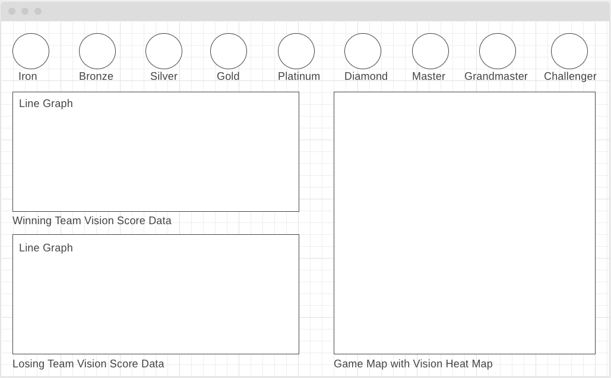

# League Ward Placement Data Visualization

## Background and Overview
  * Motivation for project
    * League of Legends is one of my favorite games to play; it's a fun, competitive game that requires skill, teamwork, and strategy to win. It also presents an excellent opportunity to analyze data from winning teams to help become better players. One of the most crucial aspects of winning a game in League of Legends is vision wards, which reveal small areas of the map and allow for monitoring of enemy players and objectives. 
  * High level overview
    * Users will be able to review and observe patterns of ward placement in a sample selection of matches ranging from the lowest tier of ranked play (iron tier) to the highest level tier (challenger tier). This mapping of data will hopefully show how locations and numbers of vision wards differ from low-level play vs. high level play. The breakdown of each role and their contribution to vision control of the map will also be graphed to show which roles typically contribute most to the success of vision control at each level of play. 

## Functionality and MVP Features
  * Users will be able to:
    * Switch between comarisons of all 9 rank tiers to see how the map data changes over different levels of competitive play
    * See a comparison of two heat/density maps of average ward placements on the game map by two different tier classes
    * See a graph comparing average vision scores for two selected tier classes
    * See a bar graph of individual role contributions to vision control (wards placed, wards destroyed)

## Wireframes
  * The app will consist of two top-down maps of the game at the bottom with two separate line graphs (one for data on each tier). There will be a navbar above each map of all the league tiers to change the data being visualized in both the line graphs and game map. 

  

## Architecture and Technologies
  * This project will implement the following technologies:
    * Vanilla JavaScript for data management
    * Riot Games Developer API used for fetching relevant game data 
    * D3 JavaScript library to visualize the game data
    * Webpack to bundle up and present the various javascript files

## Implementation Timeline
  * Day 1:
    * Set up project skeleton (set up webpack, index files)
    * Learn how to pull data through Riot Games match data API
    * Go over how to map data via D3 tutorials
  * Day 2:
    * Shape JSON information to retrieve only data relevant to ward placement
    * Learn how to utilize D3 library to map ward location data onto game map via a heat map or density map
  * Day 3:
    * Retrieve JSON information to create line graphs of relevant team data (ie. overall team vision scores)
    * Extend line graph to include individual role vision contribution data
  * Day 4:
    * Split up data by ranked tiers
    * Stylize and improve visuals of graphs